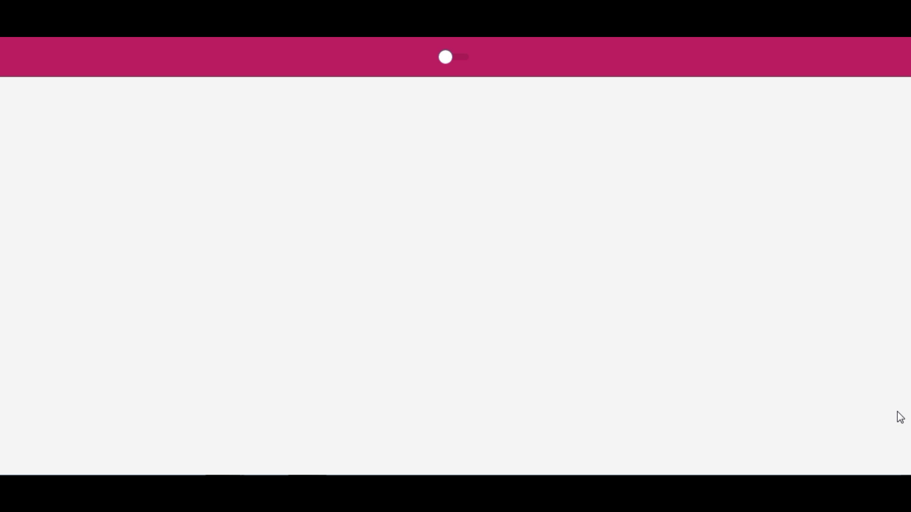

<h1 align="center">Theme Light/Dark</h1>

<p align="center">
 <a href="#Objetivo">Objetivo</a> •
 <a href="#Pré-requisitos">Pré-requisitos</a> • 
 <a href="#Tecnologias">Tecnologias</a> • 
 <a href="#Autores">Autores</a>
</p>


### Objetivo

<p align="center">"Fazer um Theme Dark para o projeto <a href="https://github.com/azevgabriel/nlw4react">Stretch</a>"</p>

### Pré-requisitos

Antes de começar, você vai precisar ter instalado em sua máquina as seguintes ferramentas:
[Git](https://git-scm.com), [Node.js](https://nodejs.org/en/). 
Além disto é bom ter um editor para trabalhar com o código como [VSCode](https://code.visualstudio.com/)

```bash
# Clone este repositório
$ $ git clone <https://github.com/azevgabriel/light-dark.react>

# Acesse a pasta do projeto no terminal/cmd
$ cd light-dark.react

# Instale as dependências
$ npm install
$ yarn install

# Execute a aplicação
$ yarn start

# O servidor iniciará na porta:3000 - acesse <http://localhost:3000>
```

### Tecnologias

As seguintes ferramentas foram usadas na construção do projeto:

- [Node.js](https://nodejs.org/en/)
- [ReactJS](https://pt-br.reactjs.org/)
- [TypeScript](https://www.typescriptlang.org/)
- [Yarn](https://yarnpkg.com/)

### Autores

Foto   | Descrição
--------- | ------
| <strong>Gabriel Azevedo</strong>, 1999 </br> Estudante de Engenharia de Computação </br>IFSULDEMINAS - Poços de Caldas</br></br> - <a href="https://github.com/azevgabriel">GitHub</a> </br> - <a href="https://www.linkedin.com/in/azevgabriel/">LinkedIn</a>
